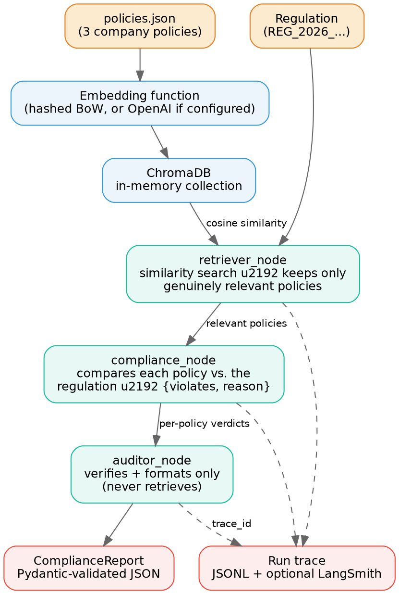
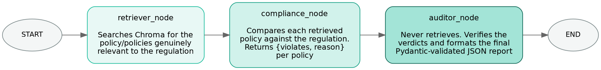
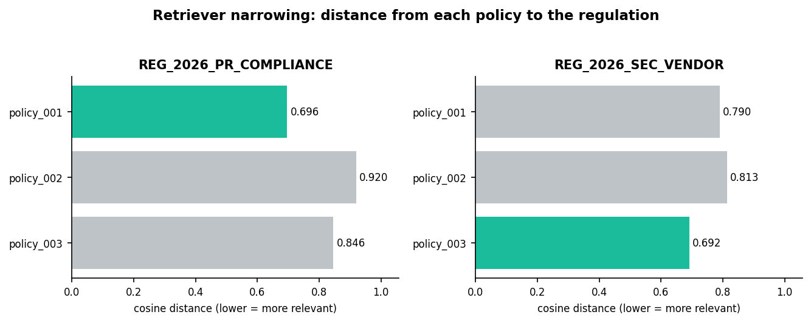

# Automated Compliance Checker


A LangGraph-based agentic pipeline that checks whether a company policy
conflicts with a new regulation, using a Chroma vector store for
retrieval and producing a schema-validated JSON verdict, with full
run tracing for observability.

## Architecture



Each node's inputs, outputs, and latency are captured by `RunTracer`
(`observability/tracer.py`), so the run is auditable even without any
external tracing account configured.

## Agent workflow



The Auditor never queries the vector store or re-retrieves anything —
it strictly consumes the Compliance Analyzer's verdicts, which keeps
"finding candidates" and "judging conflict" as separate, independently
testable responsibilities.

## Why retrieval narrows to the right policy



These are the actual cosine distances from a live run: for each
regulation, the retriever keeps the best match plus anything within a
small relative margin of it — which is what correctly narrows the
field down to `policy_001` for the PR regulation and `policy_003` for
the vendor regulation, instead of handing all three policies to the
(more expensive) comparison step.

## Folder structure

```
ComplianceChecker/
├── app.py                    # entry point
├── config.py                 # env-driven config, no hard-coded secrets
├── schema.py                 # Pydantic output contract
├── requirements.txt
├── policies/policies.json    # sample company policies
├── vectorstore/
│   ├── embeddings.py          # OpenAI embeddings (if key set) or offline hashed embedding
│   └── chroma_store.py        # builds the Chroma collection + similarity search
├── agents/
│   ├── retriever.py            # Step 1: fetch relevant policies for a regulation
│   ├── compliance_agent.py     # Step 1: compare policy vs regulation
│   ├── auditor.py               # Step 2: verify + produce structured JSON
│   ├── llm_client.py            # single choke point: real LLM or offline fallback
│   └── local_reasoner.py        # deterministic offline reasoning fallback
├── graph/compliance_graph.py    # LangGraph wiring (START -> retriever -> compliance -> auditor -> END)
├── prompts/prompts.py           # prompt templates for the real-LLM path
├── observability/tracer.py      # local JSONL tracer + LangSmith integration point
└── output/
    ├── report.json               # final structured verdict(s)
    └── traces/<trace_id>.jsonl   # per-run trace
```

## Running it

```bash
pip install -r requirements.txt
python app.py                 # runs Rule A (required) + Rule B (edge case)
python app.py --regulation A  # only the required regulation
```

No API key is required to run the full pipeline: with no
`OPENAI_API_KEY` set, the Compliance Analyzer and Auditor use a
deterministic rule-based reasoning fallback (`agents/local_reasoner.py`)
instead of calling an LLM, and the vector store uses a dependency-free
hashed bag-of-words embedding (`vectorstore/embeddings.py`) instead of
OpenAI embeddings. This keeps the prototype 100% free and offline to
run/grade, per the assignment's cost guide, while exercising the exact
same retrieval → compare → audit control flow a production version
would use.

### Using a real LLM

```bash
export OPENAI_API_KEY=sk-...
python app.py
```

This automatically switches both the embeddings and the compliance
reasoning to real OpenAI calls (`text-embedding-3-small` +
`gpt-4o-mini` by default, configurable via `OPENAI_MODEL`). No code
changes needed — `agents/llm_client.py` and
`vectorstore/embeddings.py` branch on whether the key is present.

### Enabling LangSmith tracing

```bash
export LANGCHAIN_TRACING_V2=true
export LANGCHAIN_API_KEY=ls__...
export LANGCHAIN_PROJECT=compliance-checker   # optional
python app.py
```

LangGraph/LangChain pick these up automatically and trace every node
run to your LangSmith project — no code changes required. The local
JSONL tracer in `observability/tracer.py` keeps running regardless, so
you always have an audit trail even without a LangSmith account.

## Sample output (Rule A)

```json
{
  "target_regulation": "REG_2026_PR_COMPLIANCE",
  "conflict_detected": true,
  "conflicting_policies": [
    {
      "policy_id": "policy_001",
      "reason": "..."
    }
  ],
  "recommended_action": "...",
  "trace_id": "..."
}
```

## Design notes / trade-offs

- **Retrieval narrowing**: rather than an absolute similarity-distance
  cutoff (hard to tune across embedding backends), the retriever keeps
  the best match plus anything within a small relative margin of it.
  This is what correctly narrows "which policy is this regulation
  actually about" down to one, instead of running every policy through
  the (more expensive, in production, LLM-backed) comparison step.
- **Auditor never retrieves**: it only takes the Compliance Analyzer's
  verdicts and turns them into the schema-validated report, per the
  assignment's separation of concerns.
- **Structured output via Pydantic**, not "ask the model for JSON" —
  guarantees the shape matches the expected output every time.
- **In-memory only by default**: `CHROMA_PERSIST_DIR` env var can be
  set to persist the collection to disk if needed.
- **Graceful degradation on real-LLM failures**: `get_embedding_function()`
  does a live test call before committing to OpenAI embeddings, and
  `llm_client.analyze`/`recommend` catch any OpenAI error per call —
  an invalid/expired key, no quota, or a network/allowlist issue falls
  back to the offline embedding and rule-based reasoning instead of
  crashing the whole run. Set `REQUIRE_REAL_LLM=true` to disable this
  (e.g. in the CI job whose whole purpose is proving the real-LLM path
  works) so a broken key fails loudly instead of silently passing via
  the fallback.

## Continuous integration

`.github/workflows/ci.yml` runs on every push/PR to `main` (and can be
triggered manually), with two jobs:

- **offline-smoke-test**: installs dependencies and runs the full
  pipeline for both regulations with no API keys — the hashed-embedding
  + rule-based-reasoning fallback path. Always runs, even on forks/PRs
  with no secrets configured.
- **real-llm-test**: runs the same pipeline with `OPENAI_API_KEY` and
  the `LANGSMITH_*` variables wired in from the repo's encrypted
  Actions secrets, opportunistically exercising real OpenAI
  embeddings/reasoning and reporting a traced run to LangSmith when
  those secrets work. It auto-degrades to the same offline fallback as
  the other job if they don't (bad key, no billing/quota, etc.), so a
  broken external credential never blocks CI. Set `REQUIRE_REAL_LLM: "true"`
  in the workflow's `env:` block instead if you want this job to fail
  loudly when the real path doesn't work, rather than silently falling
  back — useful when you're specifically trying to verify the key
  itself, as opposed to normal day-to-day CI.

Both jobs run `scripts/verify_report.py`, which asserts the output
matches the expected schema and regression-checks that Regulation A
flags only `policy_001` and Regulation B flags only `policy_003`, then
upload `output/report.json` + the trace files as build artifacts.

## Production hardening (out of scope here, noted for completeness)

- Multi-regulation batch processing in one run
- Multi-agent validation (Compliance + Legal + Security agents) with
  confidence scores and exact-sentence citations
- Human-in-the-loop review for low-confidence verdicts
- Policy/regulation versioning
- FastAPI endpoint + Docker + CI/CD
- Postgres + pgvector for durable, scalable storage
- AuthN/AuthZ and audit logging
